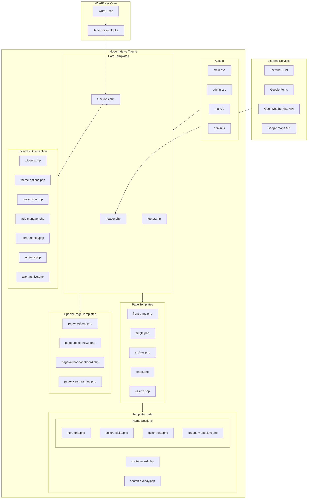
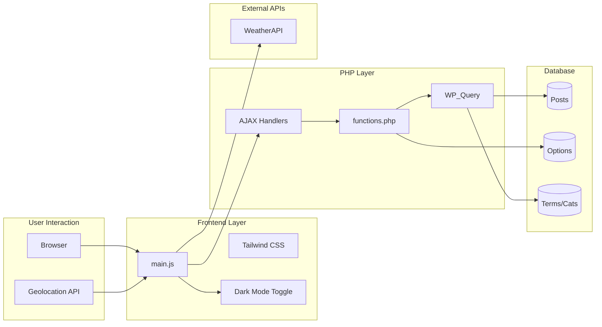
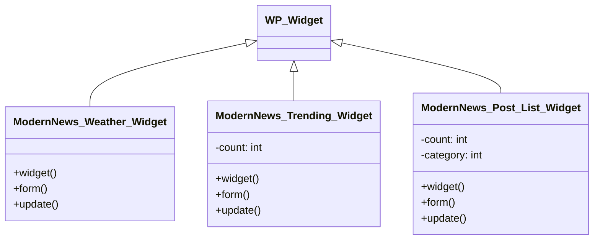
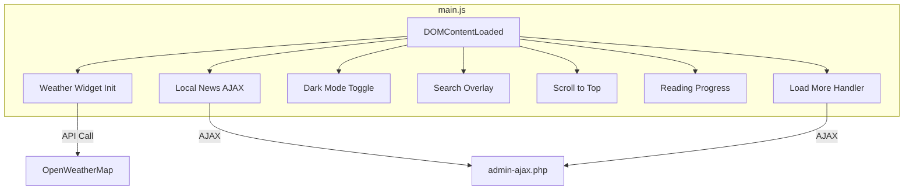

# Modern News Theme - Architecture Blueprint

## System Architecture Overview



---

## Data Flow Diagram



---

## Component Architecture

### Core Components

| Component | File | Purpose |
|-----------|------|---------|
| **Header** | `header.php` | Site header, navigation, Tailwind config, breaking news ticker |
| **Footer** | `footer.php` | Footer widgets, copyright, search overlay include |
| **Functions** | `functions.php` | Theme setup, scripts, AJAX handlers, helpers |

### Page Templates

| Template | Hierarchy | Features |
|----------|-----------|----------|
| `front-page.php` | Homepage | Modular sections (Hero, Editors, Quick Read) |
| `single.php` | Posts | E-E-A-T Date display, fetchpriority, social, schema |
| `archive.php` | Categories/Tags | Refined header, Remix Icons, AJAX load more |
| `search.php` | Search results | Premium result UI, breadcrumbs, fallback news |
| `page-submit-news.php` | Citizen News | Frontend submission form with file upload |
| `comments.php` | Comments | Redesigned thread UI with Remix Icons |

### Widget Classes



---

## CSS Architecture

### Layer Structure

```
┌────────────────────────────────────┐
│          Tailwind CSS (CDN)         │  ← Utility Layer
├────────────────────────────────────┤
│            style.css                │  ← Base Reset & Variables
├────────────────────────────────────┤
│           main.css                  │  ← Component & Custom Styles
├────────────────────────────────────┤
│          admin.css                  │  ← Admin Panel Styles
├────────────────────────────────────┤
│   Inline Customizer Styles          │  ← Dynamic Theme Colors
└────────────────────────────────────┘
```

### Design Tokens

```css
/* Primary Colors */
--primary: #168098          /* Teal - Brand primary */
--accent-yellow: #FFD600    /* Yellow - CTAs, Breaking News */
--background-dark: #212121  /* Dark mode background */

/* Spacing */
--container-width: 1200px
--gap-base: 1.5rem

/* Shadows */
--shadow-sm, --shadow-md, --shadow-lg

/* Border Radius */
--border-radius: 8px
```

---

## JavaScript Architecture

### Module Structure



### Key Functions

| Function | Trigger | Action |
|----------|---------|--------|
| Weather Widget | Page Load | Fetch weather via geolocation |
| Local News | Page Load | AJAX fetch location-based posts |
| Dark Mode | Button Click | Toggle `.dark` class on `<html>` |
| Search Overlay | Button Click | Show/hide search modal |
| Reading Progress | Scroll Event | Update progress bar width |
| Reading Progress | Scroll Event | Update progress bar width |
| Load More | Button Click | AJAX fetch next posts page |
| Citizen Submission | Form Submit | Validates and POSTs to admin-post.php |

---

## Database Schema Usage

### Options Table

| Option Key | Purpose |
|------------|---------|
| `modernnews_theme_options` | Serialized theme settings array |
| `show_on_front` | Homepage display mode (page/posts) |
| `page_on_front` | Static front page ID |

### Theme Options Structure

```php
modernnews_theme_options = [
    // API Keys
    'google_maps_api_key' => '',
    'weather_api_key' => '',
    
    // Features
    'enable_live_streaming' => false,
    'live_streaming_url' => '',
    'enable_citizen_news' => false,
    'citizen_news_url' => '',
    'subscribe_url' => '',
    
    // Social Media
    'social_facebook' => '',
    'social_twitter' => '',
    'social_instagram' => '',
    'social_youtube' => '',
    'social_tiktok' => '',
    
    // Contact
    'contact_email' => '',
    'contact_phone' => '',
    'contact_address' => '',
    
    // Footer
    'footer_about' => '',
    'footer_copyright' => '',
    'privacy_policy_url' => '',
    'terms_url' => '',
    
    // General
    'sticky_header' => false
];
```

---

## AJAX Endpoints

| Action | Handler | Purpose |
|--------|---------|---------|
| `get_local_news` | `modernnews_get_local_news()` | Fetch posts by city tag/category |
| `modernnews_load_more_posts` | `inc/ajax-archive.php` | Paginated post loading |
| `submit_citizen_news` | `admin-post.php` | Handle frontend form submission (POST) |

---

## Technical Performance Engine

| File | Feature | Purpose |
|------|---------|---------|
| `inc/performance.php` | Bloat Removal | Strips Emojis, WP version, RSD, WLW manifest |
| `inc/performance.php` | Script Deferral | Defers non-critical JS for better TBT |
| `inc/performance.php` | LCP Optimization | Disables lazy-load for first featured images |
| `inc/schema.php` | JSON-LD Automation | Automates NewsArticle, Breadcrumbs, Organization |

---

## Security Measures

- **Nonce Verification**: All AJAX calls use `wp_create_nonce()` / `check_ajax_referer()`
- **Capability Checks**: Admin pages require `manage_options`
- **Data Sanitization**: `sanitize_text_field()`, `esc_html()`, `esc_attr()` used throughout
- **Prepared Queries**: WP_Query used for database access (no raw SQL)

---

## Performance Considerations

| Feature | Implementation |
|---------|----------------|
| **Asset Loading** | CSS/JS enqueued properly with dependencies |
| **Image Handling** | WordPress thumbnail sizes (medium_large, full) |
| **AJAX Loading** | Infinite scroll reduces initial page load |
| **CDN Assets** | Tailwind, fonts loaded from CDN |

### Recommended Optimizations

1. Move Tailwind from CDN to compiled CSS
2. Implement image lazy loading
3. Add service worker for offline support
4. Cache weather API responses
5. Minify and bundle JS files

---

## Extensibility Points

### Actions
- `wp_head` - Add custom scripts/styles
- `wp_footer` - Footer scripts
- `wp_enqueue_scripts` - Enqueue assets
- `widgets_init` - Register widgets

### Filters
- `query_vars` - Add custom query parameters
- `pre_get_posts` - Modify main query
- `widget_title` - Filter widget titles
- `the_content` - Modify post content

---

## Version History

| Version | Changes |
|---------|---------|
| 1.0.0 | Initial release |
| 1.0.1 | Bug fixes, theme options improvements |
| 1.2.0 | Added Ads Manager, Citizen News, Widgets, Polished Templates |

---

*Blueprint generated: 2026-01-20*
